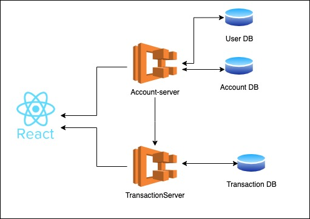

<h1 align="center">Cuddly Guacamole</h1>
Application for manage user, add current account, create new debit transaction

**Local Port**
react-app: http://localhost:3000<br/>
account-server: http://localhost:8080<br/>
Api Doc: http://localhost:8080/api-docs<br/>
transaction-server: http://localhost:8081<br/>
Api Doc: http://localhost:8081/api-docs<br/>
## Table of Contents

- [Table of Contents](#table-of-contents)
- [Architecture/Service Diagram](#Arcitecture/service-diagram)
- [Installation](#installation)
  - [Step 1: Set up the Development Environment](#step-1-set-up-the-development-environment)
  - [Step 2: Set up Env](#step-2-set-up-env)
  - [Step 3: Install dependencies](#step-3-install-dependencies)
  - [Step 4: Running Locally](#step-4-running-locally)
- [Usage Tutorial](#usage-tutorial)
- [Error Statuses](#error-status)
- [Features](#features)
  - [Express](#express)
  - [React](#react)
  - [Typescript](#typescript)
  - [EsLint](#EsLint)
- [License](#license)
## Architecture/Service Diagram

## Installation

Clone this repo to your local machine.

### Step 1: Set up the Development Environment

Prerequisites:
You must have Docker Installed in your System !

**Install [Docker](https://docs.docker.com/get-docker/)**
Download url: https://docs.docker.com/get-docker/

**Starting the application**
Navigate to the **Main folder** directory and run the below command in your terminal :
```bash
$ docker-compose -f docker-compose-local.yml up -d
```

To stop the docker images :
```bash
$ docker-compose -f docker-compose-local.yml down
```
## Usage Tutorial
  [Usage tutorial doc](docs/Tutorial.md)
## Error Status
  [Error status doc](docs/ErrorStatus.md)

## Features

### Express

Express is a minimal and flexible Node.js web application framework that provides a robust set of features for web and mobile applications.

### React

React makes it painless to create interactive UIs. Design simple views for each state in your application, and React will efficiently update and render just the right components when your data changes.

### Typescript

TypeScript is an open-source programming language developed and maintained by Microsoft. It is a strict syntactical superset of JavaScript, and adds optional static typing to the language. TypeScript is designed for development of large applications and transcompiles to JavaScript.

### EsLint

EsLint is an extensible static analysis tool that checks TypeScript code for readability, maintainability, and functionality errors


## License

[](http://badges.mit-license.org)

- **[MIT license](http://opensource.org/licenses/mit-license.php)**
