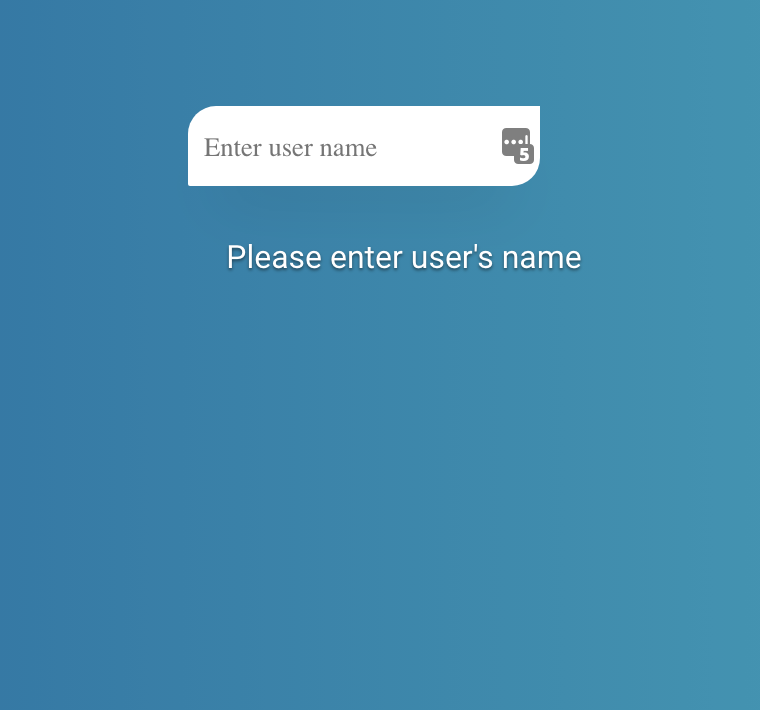
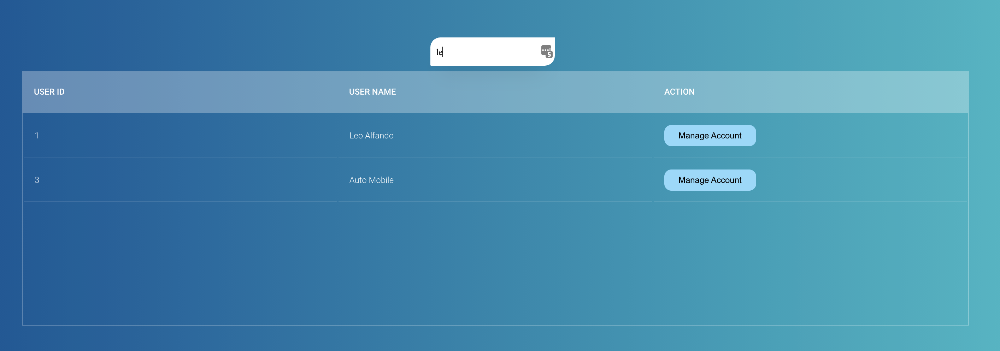
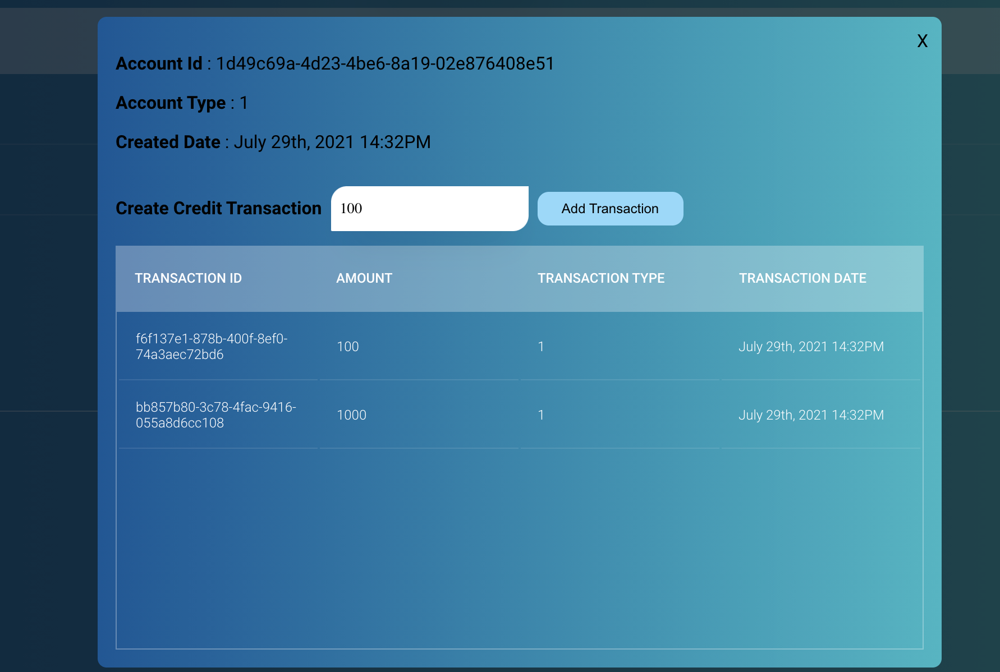

<h1 align="center">Cuddly Guacamole Usage Tutorial</h1>

PATH: localhost:3000  
### Step 1: Key user name search keyword
In this view, the user is required to key in search keyword (minimum 2 characters)

### Step 2: Client list
In this view, the user can see a list of clients and if the user clicks on the managed account it will open up a user account management view

### Step 3: Account management
Users will be able to create a client's current account simply by clicking on create button,
if the user key in initial account credit system will create the account with a new transaction altogether

### Step 4: Account management - 2
After the account created user will be able to see the detail of the account

### Step 5: Create new transaction
By typing in amount and click on add transaction, a new transaction will be created and appear on the transaction table bellow

